# MFAgent Design Documentation

This document contains architectural and design diagrams for the MFAgent application, generated using Mermaid.js.

## 1. System Context Diagram (C4 Level 1)
High-level view of how the User interacts with the MFAgent and external systems.

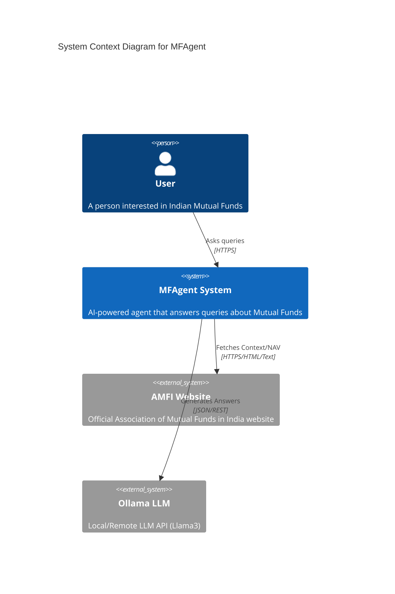

## 2. Container Diagram (C4 Level 2)
Shows the high-level technical building blocks.

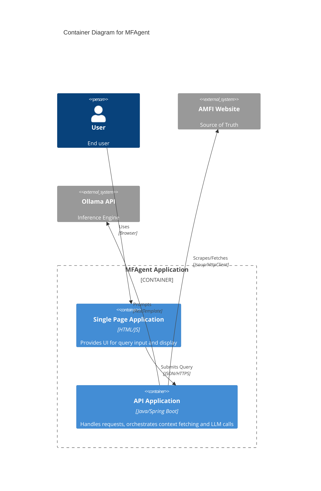

## 3. Component Diagram (C4 Level 3)
Details the internal components of the Spring Boot API.

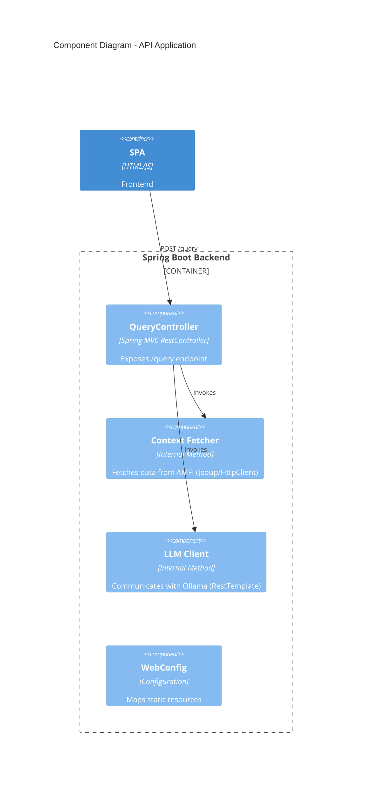

## 4. Deployment Diagram
Shows how the system is deployed physically/virtually.

```mermaid
graph TD
    subgraph User_Device [User Device]
        Browser[Web Browser]
    end

    subgraph Server_Node [Application Server]
        Tomcat[Embedded Tomcat]
        SpringBoot[MFAgent Jar]
    end

    subgraph External_Services [External Cloud/Network]
        AMFI[AMFI Web Server]
        OllamaServer[Ollama Server (GPU/CPU)]
    end

    Browser -- HTTP/8080 --> Tomcat
    Tomcat -- Hosts --> SpringBoot
    SpringBoot -- HTTPS --> AMFI
    SpringBoot -- HTTP/11434 --> OllamaServer
```

## 5. Use Case Diagram
Functional requirements and actors.

```mermaid
usecaseDiagram
    actor User
    actor "AMFI System" as AMFI
    actor "Ollama AI" as AI

    package MFAgent {
        usecase "Submit Query" as UC1
        usecase "View Response" as UC2
        usecase "Fetch Market Data" as UC3
        usecase "Generate Insight" as UC4
        usecase "Handle Errors" as UC5
    }

    User --> UC1
    User --> UC2
    UC1 ..> UC3 : include
    UC1 ..> UC4 : include
    UC3 --> AMFI
    UC4 --> AI
    UC1 --> UC5 : extends
```

## 6. Class Diagram
Structure of the Java classes.

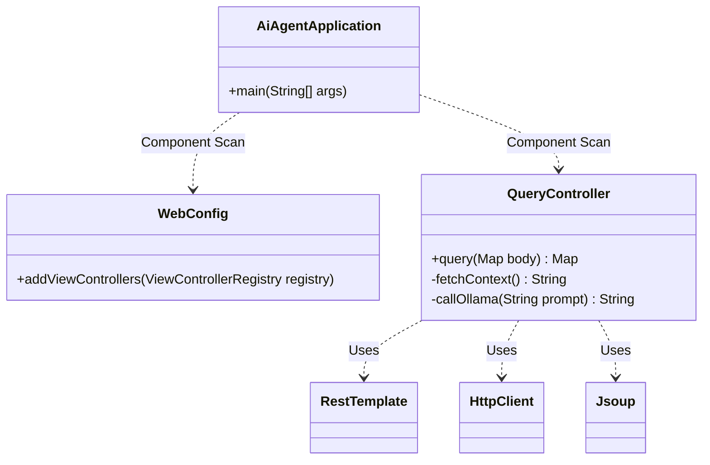

## 7. Sequence Diagram: Happy Path
Successful query execution flow.

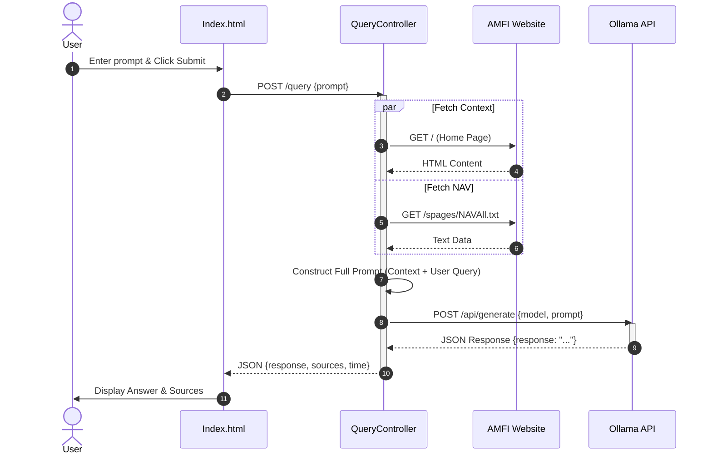

## 8. Sequence Diagram: Context Fetch Failure
Handling errors when AMFI is down.

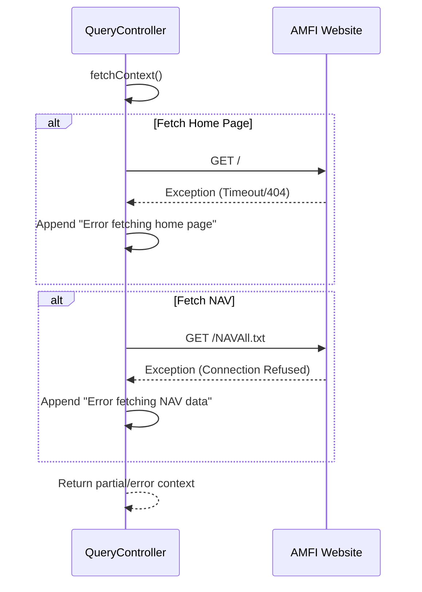

## 9. Sequence Diagram: LLM Failure
Handling errors when Ollama is unreachable.

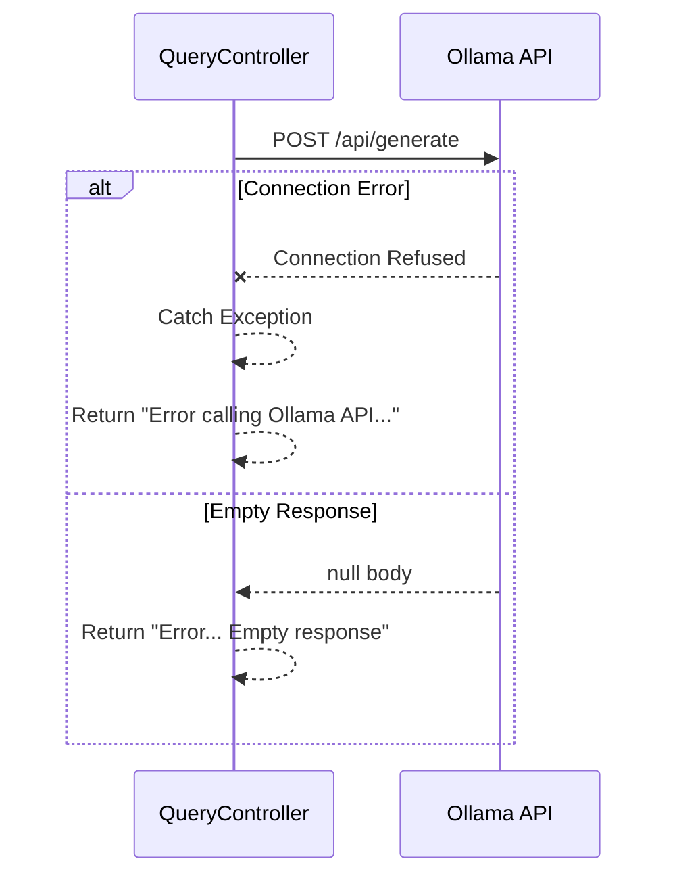

## 10. Activity Diagram: User Interaction
Flow of user actions on the frontend.

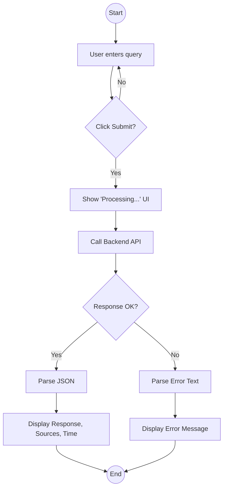

## 11. Activity Diagram: Backend Processing
Logic flow inside `QueryController`.

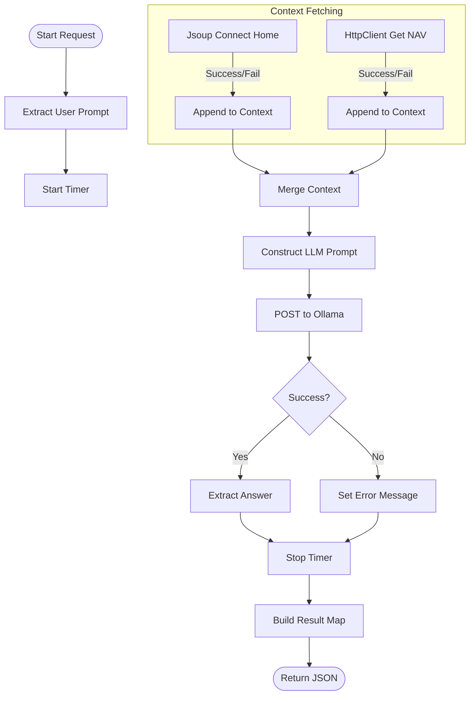

## 12. State Transition Diagram: Request Lifecycle
Conceptual states of a request within the controller.

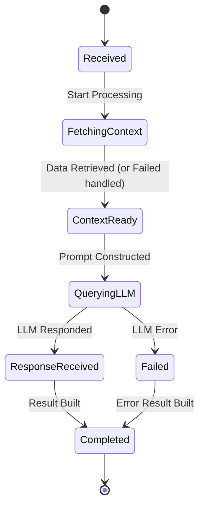

## 13. State Transition Diagram: UI Component
States of the frontend interface.

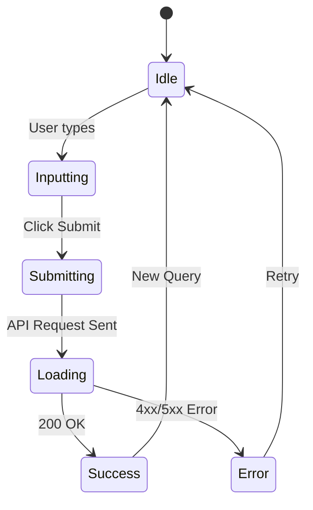

## 14. Entity Relationship Diagram (Conceptual)
Data model of the information flow.

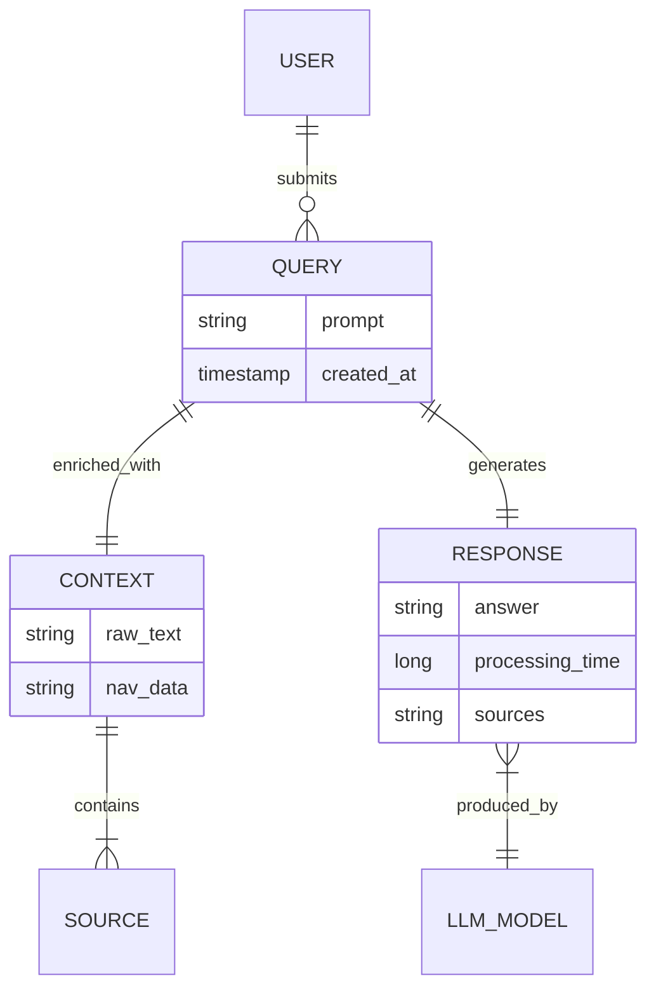

## 15. Data Flow Diagram (Level 0)
High-level data movement.

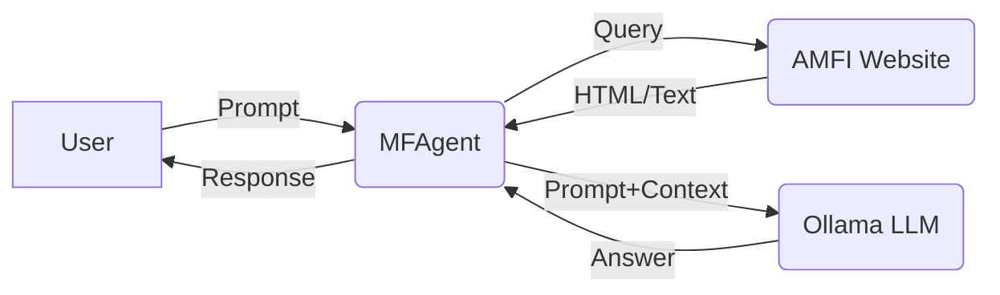

## 16. Data Flow Diagram (Level 1)
Detailed data movement within the system.

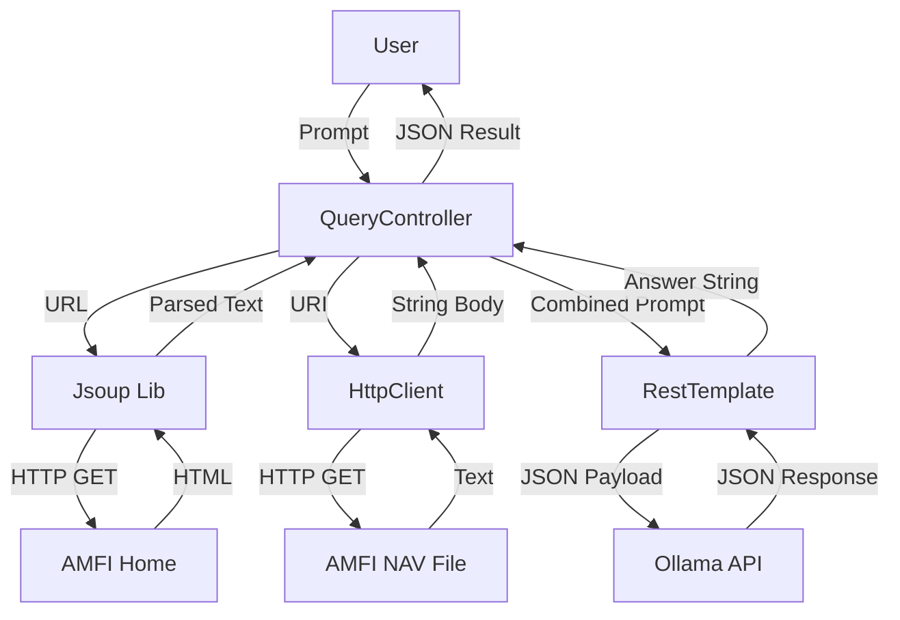

## 17. Mind Map: Project Structure
Visualizing the project organization.

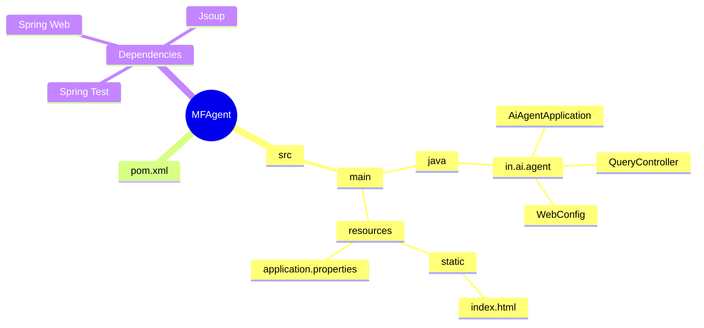

## 18. Gantt Chart: Implementation Plan
Hypothetical timeline for building this agent.

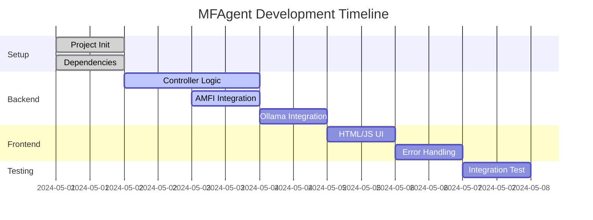

## 19. Git Graph
Hypothetical version control history.

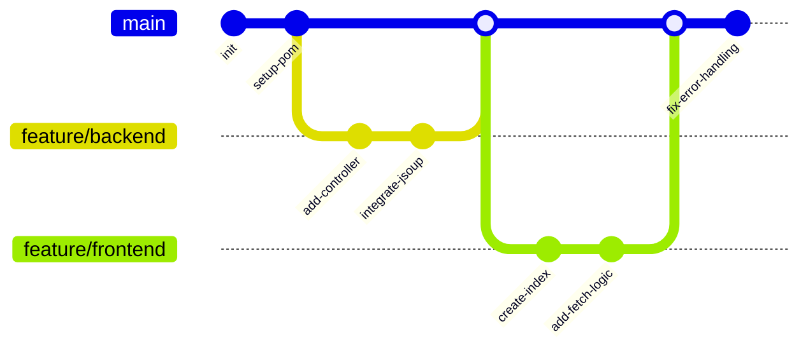

## 20. Requirement Diagram
Mapping functional requirements to system components.

```mermaid
requirementDiagram

    requirement req1 {
        id: 1
        text: "User shall be able to input queries"
        risk: low
        verifymethod: test
    }

    requirement req2 {
        id: 2
        text: "System shall fetch real-time context from AMFI"
        risk: medium
        verifymethod: inspection
    }

    requirement req3 {
        id: 3
        text: "System shall use LLM for answer generation"
        risk: high
        verifymethod: demonstration
    }

    element index_html {
        type: file
    }

    element QueryController {
        type: class
    }

    index_html - satisfies -> req1
    QueryController - satisfies -> req2
    QueryController - satisfies -> req3
```

## 21. Pie Chart: Code Composition
Rough estimation of code distribution.

```mermaid
pie title Code Composition
    "Java (Backend Logic)" : 60
    "HTML/JS (Frontend)" : 20
    "XML/Config (Maven/Props)" : 10
    "Documentation" : 10
```
